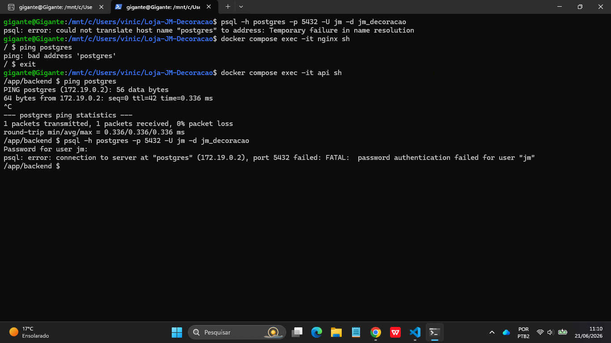
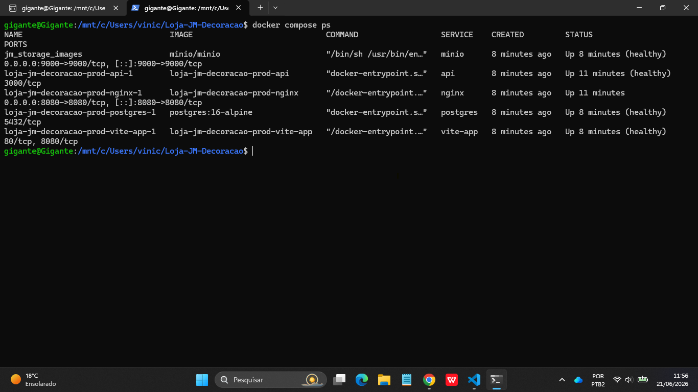
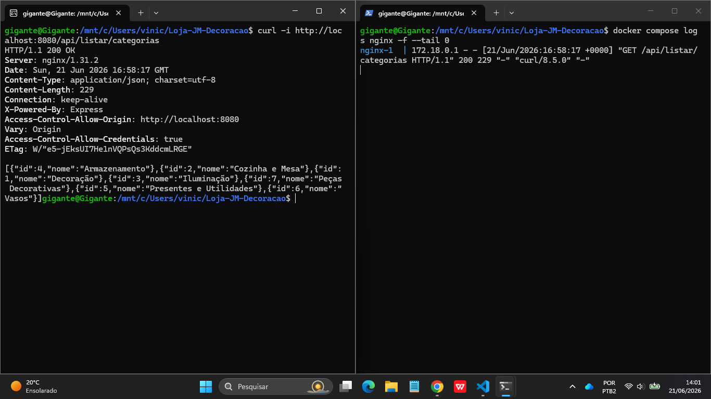
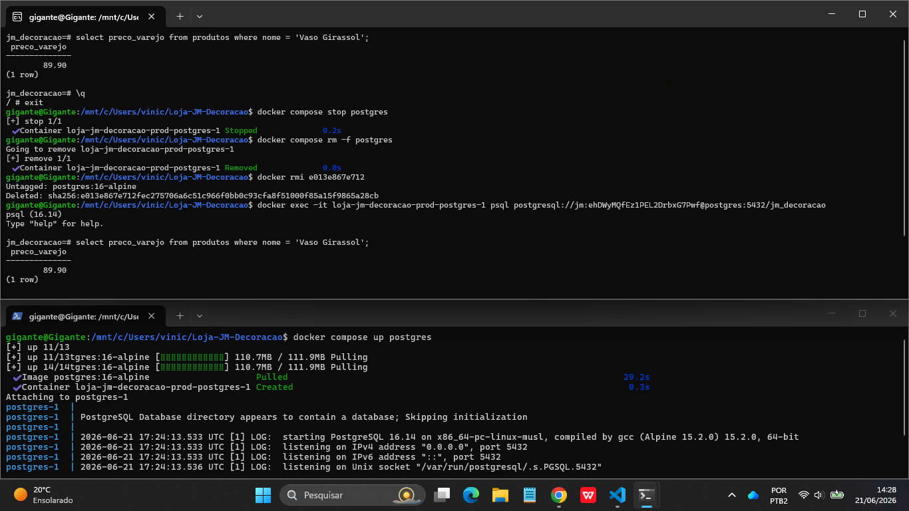
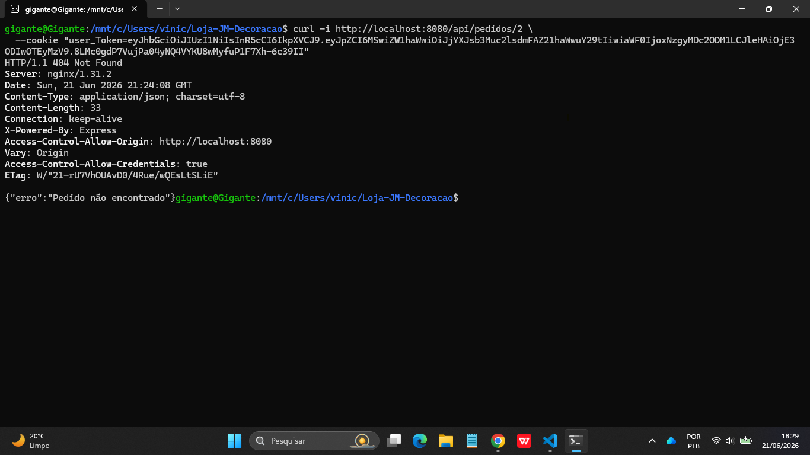
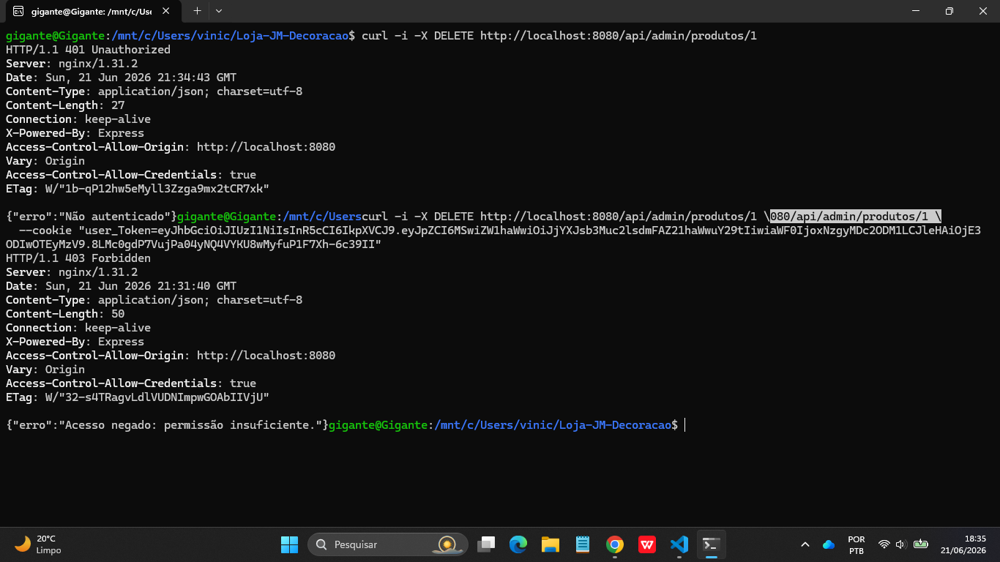

# Evidências de Segurança

## Evidência 1 — Tentativas de Conexão ao PostgreSQL

Esta evidência tem como objetivo demonstrar a segmentação de rede da aplicação e validar que o banco de dados PostgreSQL não está exposto indiscriminadamente aos demais componentes da arquitetura.

O teste foi realizado a partir de diferentes pontos do sistema, simulando tentativas de acesso ao banco de dados por serviços com níveis distintos de autorização.

### Evidência



### Análise dos Resultados

#### Host → PostgreSQL

Foi realizada uma tentativa de conexão diretamente a partir do sistema hospedeiro utilizando o cliente PostgreSQL.

O host não conseguiu resolver o nome interno do serviço `postgres`, demonstrando que o banco de dados está registrado apenas na rede privada do Docker Compose e não pode ser localizado diretamente por processos externos ao ambiente containerizado.

#### Nginx → PostgreSQL

Foi realizada uma tentativa de localizar o serviço `postgres` a partir do container responsável pela camada de apresentação.

A resolução falhou, evidenciando que o Nginx não possui conectividade direta com a rede do banco de dados.

Essa separação impede que a camada de frontend realize acesso direto à persistência da aplicação.

#### Backend → PostgreSQL

Foi realizada uma tentativa de comunicação a partir do serviço de backend.

O serviço conseguiu resolver o nome `postgres` e localizar o endereço IP interno do banco de dados, comprovando que existe conectividade entre a camada de aplicação e a camada de persistência.

Essa comunicação é necessária para o funcionamento normal da API.

#### Backend → PostgreSQL sem autenticação válida

Após confirmar a conectividade, foi realizada uma tentativa de acesso sem fornecer credenciais válidas.

O PostgreSQL respondeu solicitando autenticação e rejeitou a conexão, demonstrando que a simples capacidade de alcançar o serviço não é suficiente para obter acesso aos dados.

### Conclusão

Os testes demonstram que o PostgreSQL opera atrás de múltiplas camadas de proteção.

O banco de dados não é acessível diretamente pelo host, não é acessível pela camada de frontend e aceita conexões apenas dos serviços autorizados pela arquitetura.

Além disso, mesmo para origens autorizadas, o PostgreSQL exige autenticação válida antes de permitir qualquer operação sobre os dados armazenados.

Dessa forma, a persistência da aplicação permanece restrita à camada de backend, reduzindo a superfície de exposição e aplicando o princípio do menor privilégio na comunicação entre serviços.

---

# Evidências de Resiliência e Orquestração

## Evidência 2 — Containers em Estado Healthy

Esta evidência tem como objetivo demonstrar que os serviços da aplicação foram inicializados corretamente pelo Docker Compose e que os mecanismos de monitoramento de saúde (healthchecks) configurados para os componentes críticos da arquitetura estão funcionando conforme esperado.

O teste foi realizado através do comando:

```bash
docker compose ps
```

### Evidência




## Evidência 3 — Fluxo de Comunicação entre Cliente, Nginx e Backend

Esta evidência tem como objetivo demonstrar o funcionamento integrado da arquitetura da aplicação em tempo de execução, validando o fluxo completo de requisição desde o cliente até o backend, passando pelo proxy reverso Nginx e retornando dados processados a partir da camada de persistência.

### Evidência




## Evidência 4 — Persistência de Dados no PostgreSQL

Esta evidência tem como objetivo demonstrar que os dados armazenados na base PostgreSQL permanecem íntegros mesmo após interrupção e recriação do serviço de banco de dados, validando o uso de volumes Docker como mecanismo de persistência.

O teste foi realizado através da execução de consultas SQL antes da reinicialização do container, seguido da parada completa do serviço PostgreSQL, recriação do container e posterior verificação dos mesmos dados após o reestabelecimento do banco.

Análise dos Resultados
Estado inicial do banco de dados

Foi realizada uma consulta ao banco de dados retornando registros da tabela de produtos.

O produto “Vaso Girassol” foi localizado corretamente, com valor de preco_varejo = 89.90, confirmando que os dados estavam armazenados e acessíveis antes da reinicialização do serviço.

### Evidência




## Evidência 5 — Tentativa de acesso de dados de cliente

Esta evidência tem como objetivo demonstrar o isolamento de dados entre usuários autenticados, validando que um cliente não consegue acessar informações pertencentes a outro usuário dentro do sistema.

O teste foi realizado utilizando um usuário autenticado (via cookie de sessão JWT) e executando requisições diretas à API para acessar pedidos com identificadores diferentes do usuário logado.

Foi feita uma requisição para a rota de pedidos (GET /api/pedidos/:id) utilizando autenticação válida, porém tentando acessar um pedido que não pertence ao cliente autenticado.

Análise dos Resultados

A requisição foi processada normalmente pelo sistema, porém o retorno indicou que o recurso não está disponível para o usuário autenticado.

Quando o pedido não pertence ao cliente, a API retorna uma resposta de erro indicando que o recurso não foi encontrado ou não está acessível, impedindo exposição de dados de terceiros.

### Evidência




## Evidência 6 — Tentativa de acesso de dados confidenciais administrativos

Esta evidência tem como objetivo demonstrar a proteção de rotas administrativas e operações críticas do sistema, garantindo que apenas usuários com permissões adequadas possam executar ações sensíveis.

O teste foi realizado utilizando um usuário autenticado com perfil de cliente e tentando executar uma operação administrativa de remoção de produto (DELETE /api/admin/produtos/:id).

Análise dos Resultados

A requisição foi bloqueada pela camada de autorização da aplicação.

Quando um usuário sem permissão administrativa tenta acessar uma rota protegida, o sistema retorna erro de autorização (403 Forbidden), impedindo a execução da operação.

Mesmo com autenticação válida, o usuário cliente não possui privilégios para modificar ou excluir recursos administrativos.

### Evidência

